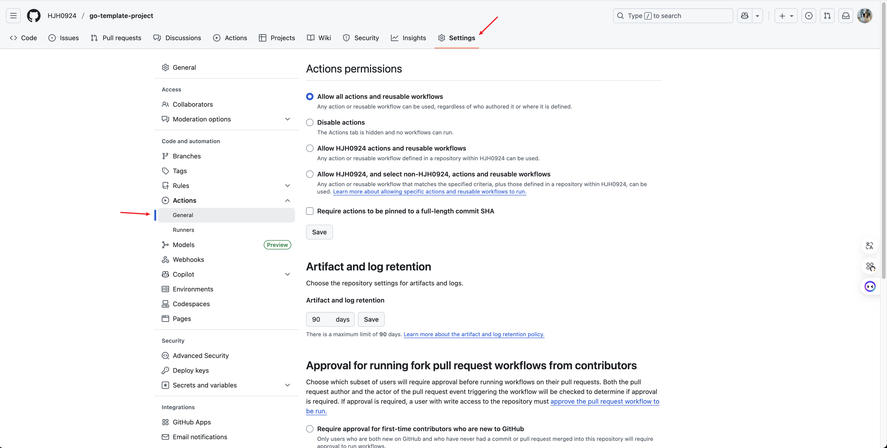
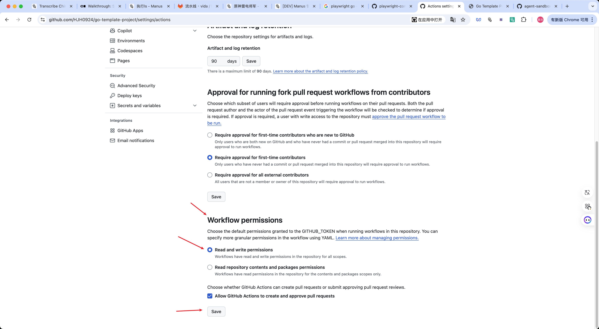
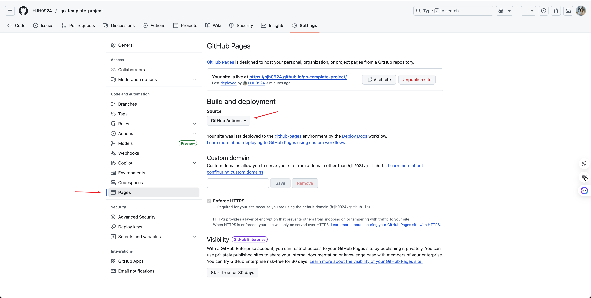

# 文档自动化部署指南

本指南将帮助你配置 GitHub Actions 自动化部署 VitePress 文档到 GitHub Pages。

## 目录

- [概述](#概述)
- [前置要求](#前置要求)
- [配置步骤](#配置步骤)
- [工作流文件说明](#工作流文件说明)
- [部署流程](#部署流程)
- [验证部署](#验证部署)
- [故障排除](#故障排除)

## 概述

项目已经配置了自动化部署流程，当你推送代码到 `main` 分支时，GitHub Actions 会自动：

1. 构建 VitePress 文档
2. 将构建产物部署到 GitHub Pages
3. 你的文档将在 `https://<username>.github.io/<repository>/` 上线

## 前置要求

- GitHub 仓库已创建
- 代码已推送到 GitHub
- 仓库中已包含 `.github/workflows/deploy-docs.yml` 文件
- 文档源文件位于 `docs/` 目录

## 配置步骤

### 步骤 1: 启用 GitHub Actions

1. 进入你的 GitHub 仓库
2. 点击 **Settings**（设置）标签
3. 在左侧菜单中点击 **Actions** > **General**



4. 在 **Actions permissions** 部分，选择：
   - **Allow all actions and reusable workflows**（允许所有 actions 和可重用的工作流）

5. 向下滚动到 **Workflow permissions** 部分



6. 选择以下选项：
   - **Read and write permissions**（读写权限）
   - 勾选 **Allow GitHub Actions to create and approve pull requests**

7. 点击 **Save** 保存设置

### 步骤 2: 配置 GitHub Pages

1. 在仓库的 **Settings** 页面
2. 在左侧菜单中点击 **Pages**



3. 在 **Build and deployment** 部分：
   - **Source**: 选择 **GitHub Actions**

4. 配置完成后，GitHub Pages 将等待第一次部署

### 步骤 3: 触发部署

配置完成后，你可以通过以下方式触发部署：

#### 方式 1: 推送代码（自动触发）

```bash
# 修改任何文档文件或 docs/ 目录下的文件
git add .
git commit -m "docs: update documentation"
git push origin main
```

#### 方式 2: 手动触发

1. 进入仓库的 **Actions** 标签
2. 在左侧选择 **Deploy Docs** 工作流
3. 点击 **Run workflow** 按钮
4. 选择 `main` 分支
5. 点击绿色的 **Run workflow** 按钮

## 工作流文件说明

项目中的 `.github/workflows/deploy-docs.yml` 文件定义了自动部署流程：

```yaml
name: Deploy Docs

on:
  push:
    branches:
      - main
    paths:
      - '**.md'
      - 'docs/**'
  workflow_dispatch:

permissions:
  contents: read
  pages: write
  id-token: write

concurrency:
  group: pages
  cancel-in-progress: false

jobs:
  build:
    name: Build Documentation
    runs-on: ubuntu-latest
    steps:
      # ... 构建步骤 ...

  deploy:
    name: Deploy to GitHub Pages
    needs: build
    runs-on: ubuntu-latest
    steps:
      # ... 部署步骤 ...
```

### 触发条件

工作流会在以下情况下触发：

1. **自动触发**：
   - 推送到 `main` 分支
   - 修改了任何 `.md` 文件
   - 修改了 `docs/` 目录下的任何文件

2. **手动触发**：
   - 通过 GitHub Actions 页面手动运行

### 权限设置

```yaml
permissions:
  contents: read      # 读取仓库内容
  pages: write        # 写入 GitHub Pages
  id-token: write     # 写入 ID token（用于部署）
```

### 并发控制

```yaml
concurrency:
  group: pages
  cancel-in-progress: false
```

- 只允许一个部署任务运行
- 不会取消正在进行的部署（确保生产部署完成）

## 部署流程

### 构建阶段（Build Job）

1. **Checkout code**: 检出代码（获取完整历史记录）
2. **Setup pnpm**: 安装 pnpm 包管理器（版本 10.12.4）
3. **Setup Node.js**: 安装 Node.js 20 并配置 pnpm 缓存
4. **Setup Pages**: 配置 GitHub Pages 环境
5. **Install dependencies**: 安装项目依赖
6. **Build documentation**: 构建 VitePress 文档
7. **Upload artifact**: 上传构建产物

### 部署阶段（Deploy Job）

1. **等待构建完成**: `needs: build`
2. **Deploy to GitHub Pages**: 部署构建产物到 GitHub Pages

完整的部署流程大约需要 2-3 分钟。

## 验证部署

### 1. 检查 Actions 运行状态

1. 进入仓库的 **Actions** 标签
2. 查看最新的 **Deploy Docs** 工作流运行记录
3. 确认两个 Job 都成功完成（绿色对勾）：
   - Build Documentation
   - Deploy to GitHub Pages

### 2. 查看部署详情

在 **Settings** > **Pages** 页面，你会看到：

```
Your site is live at https://<username>.github.io/<repository>/
Last deployed by <your-username> X minutes ago
```

### 3. 访问网站

点击链接或直接访问你的文档网站：

```
https://hjh0924.github.io/go-template-project/
```

### 4. 检查部署历史

在 **Actions** 标签中，你可以查看所有的部署历史记录和日志。

## 故障排除

### 问题 1: Actions 权限错误

**错误信息**：
```
Error: Resource not accessible by integration
```

**解决方法**：
1. 检查 Settings > Actions > General
2. 确认已选择 **Read and write permissions**
3. 保存设置后重新运行工作流

### 问题 2: Pages 未配置

**错误信息**：
```
Error: Failed to create deployment
```

**解决方法**：
1. 进入 Settings > Pages
2. 确认 **Source** 设置为 **GitHub Actions**
3. 等待几分钟后重新部署

### 问题 3: 构建失败

**错误信息**：
```
npm ERR! code ELIFECYCLE
```

**解决方法**：

```bash
# 本地测试构建
cd docs
pnpm install
pnpm run docs:build

# 如果本地构建成功，检查：
# 1. package.json 中的依赖版本
# 2. Node.js 版本是否匹配（20）
# 3. pnpm-lock.yaml 是否已提交
```

### 问题 4: 页面 404

**问题**：访问部署后的网站显示 404

**解决方法**：

1. 检查 VitePress 配置中的 `base` 路径：

```ts
// docs/.vitepress/config.mts
export default defineConfig({
  base: '/go-template-project/',  // 必须与仓库名称匹配
  // ...
})
```

2. 确保 `base` 路径格式正确：
   - 以 `/` 开头
   - 以 `/` 结尾
   - 与仓库名称完全一致（区分大小写）

### 问题 5: 资源文件无法加载

**问题**：CSS、JS 或图片无法加载

**解决方法**：

检查静态资源引用路径：

```markdown
<!-- 错误 -->


<!-- 正确 -->

```

在 VitePress 中，相对路径会自动处理 `base` 路径。

### 问题 6: 部署超时

**问题**：部署任务运行时间过长

**解决方法**：

1. 检查依赖大小：
```bash
cd docs
du -sh node_modules
```

2. 优化构建配置：
```ts
// docs/.vitepress/config.mts
export default defineConfig({
  // 减少构建时间
  mpa: false,
  cleanUrls: true,
})
```

3. 使用缓存（已在工作流中配置）

## 自定义配置

### 修改触发条件

如果你想要在其他分支部署，修改 `.github/workflows/deploy-docs.yml`：

```yaml
on:
  push:
    branches:
      - main
      - develop  # 添加其他分支
    paths:
      - '**.md'
      - 'docs/**'
```

### 修改 Node.js 版本

```yaml
- name: Setup Node.js
  uses: actions/setup-node@v4
  with:
    node-version: 20  # 修改为其他版本
```

### 添加构建前检查

在构建步骤前添加 lint 检查：

```yaml
- name: Lint documentation
  run: pnpm run docs:lint
  working-directory: docs
```

### 自定义域名

如果你有自定义域名，在 `docs/public/` 目录下创建 `CNAME` 文件：

```bash
echo "docs.example.com" > docs/public/CNAME
```

然后在 GitHub Pages 设置中配置自定义域名。

## 部署其他环境

### 部署到其他平台

虽然本项目配置了 GitHub Pages，但 VitePress 可以部署到任何静态网站托管平台：

#### Netlify

```bash
# 构建命令
cd docs && pnpm install && pnpm run docs:build

# 发布目录
docs/.vitepress/dist
```

#### Vercel

```bash
# 构建命令
cd docs && pnpm install && pnpm run docs:build

# 输出目录
docs/.vitepress/dist
```

#### Cloudflare Pages

```bash
# 构建命令
cd docs && pnpm install && pnpm run docs:build

# 构建输出目录
docs/.vitepress/dist
```

## 最佳实践

### 1. 分支保护

为 `main` 分支设置保护规则：

1. Settings > Branches > Add rule
2. 要求 Pull Request 审查
3. 要求状态检查通过后才能合并

### 2. 部署通知

配置 GitHub Actions 通知：

1. Settings > Notifications
2. 启用 Actions 工作流通知
3. 选择通知方式（Email、Web、Mobile）

### 3. 版本控制

为重要发布创建 Git 标签：

```bash
git tag -a v1.0.0 -m "Release version 1.0.0"
git push origin v1.0.0
```

### 4. 定期更新依赖

定期更新 Actions 和 Node.js 依赖：

```bash
cd docs
pnpm update
```

### 5. 监控构建时间

关注构建时间，如果超过 5 分钟，考虑优化：

- 减少依赖数量
- 使用缓存
- 优化图片资源

## 相关资源

- [GitHub Actions 文档](https://docs.github.com/en/actions)
- [GitHub Pages 文档](https://docs.github.com/en/pages)
- [VitePress 部署指南](https://vitepress.dev/guide/deploy)
- [pnpm 文档](https://pnpm.io/)

## 总结

通过以上配置，你的文档将实现：

- 自动化构建和部署
- 无需手动操作
- 每次推送自动更新
- 快速的部署流程（2-3 分钟）
- 免费的文档托管

如果遇到问题，可以查看 Actions 运行日志或参考故障排除部分。
